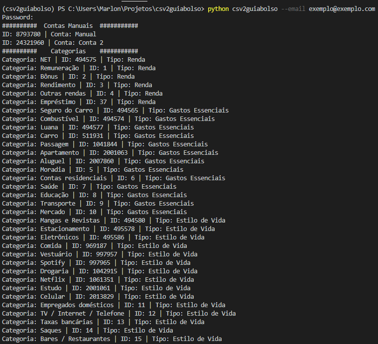
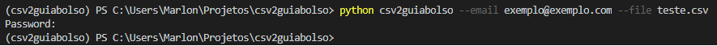
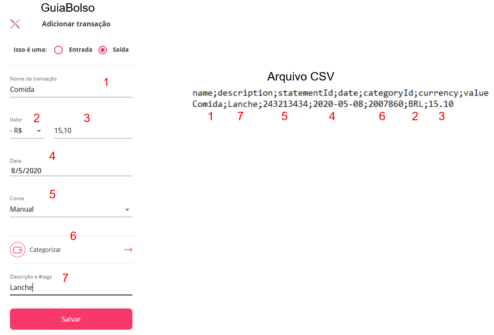

=============
csv2GuiaBolso
=============

csv2GuiaBolso é um programa em Python que tem o objetivo de criar lançamentos manuais a partir de um arquivo csv

O GuiaBolso_ é um app criado para agregar transações de diversas contas e classificá-las de forma *quase* automática. A agregação e a classificação são bastante úteis no auxílio do controle dos gastos. O problema é que a análise dos dados é limitada ao que é oferecido pela plataforma. Além disso, os clientes não têm posse de seus dados, caso a empresa deixe de existir ou ocorra alguma mudança na política, os dados podem ser perdidos para sempre. 

* O GuiaBolso2csv permite que os dados sejam baixados e então usados (e guardados) da forma que for mais conveniente. Além do formato csv há a opção de gerar um arquivo xlsx (formato do Excel).
* O csv2Guiabolso permite que sejam feitos lançamentos manuais a partir de um arquivo csv

.. _GuiaBolso: https://www.guiabolso.com.br/

Agradecimento
---------------
Todas as ideias, funcionalidade e códigos foram inspirados no repositório do Hugo Sadok.

https://github.com/hsadok/guiabolso2csv

Funcionalidades
---------------

* Criar lançamentos manuais a partir de um arquivo csv

* Visualizar os códigos e nomes das Categorias e Contas manuais cadastradas no GuiaBolso

Uso Básico
----------

1 - Visualizar as Contas e Categorias

    csv2guiabolso --email exemplo@exemplo.com

O único dado não especificado foi a senha, que é requisitada pelo programa.

2 - Criar lançamentos a partir de csv

    csv2guiabolso --email exemplo@exemplo.com --file arquivo.csv

Layout do Arquivo CSV
-------------

O arquivo CSV deve ter as colunas abaixo e utilizar o separador ;

name;description;statementId;date;categoryId;currency;value

Baixando o repositório
----------------------

Caso deseje contribuir para este reprositório ou simplesmente prefere baixar diretamente (sem usar o PyPI). Siga as instruções a seguir.

Você deve ter ``git`` e ``pip`` instalados para, respectivamente, baixar o repositório e instalar as dependências.

Clone o repositório::

    git clone git@github.com:marlindo71/csv2guiabolso.git

Vá para o repositório que você acabou de clonar e instale as dependências com ``pip``::

    cd csv2guiabolso
    pip install -r requirements.txt

Pronto, você já pode usar o GuiaBolso2csv a partir do código baixado fazendo::

    python csv2guiabolso

